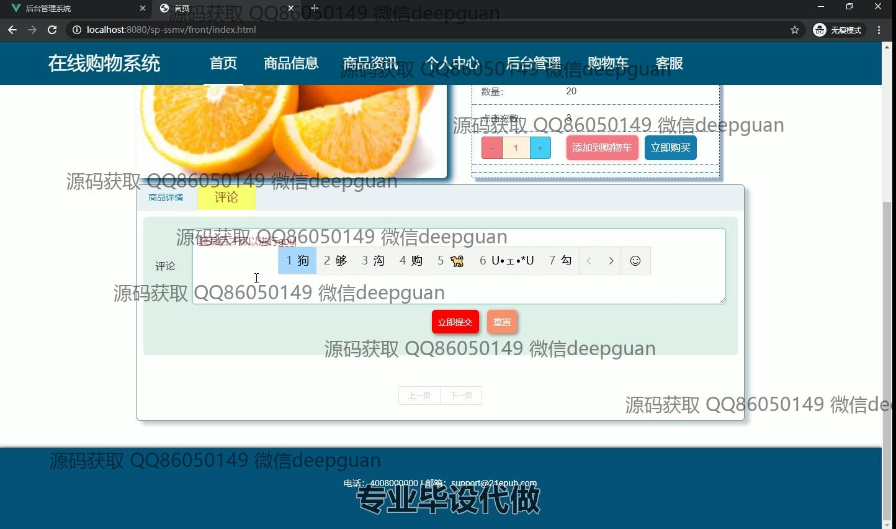
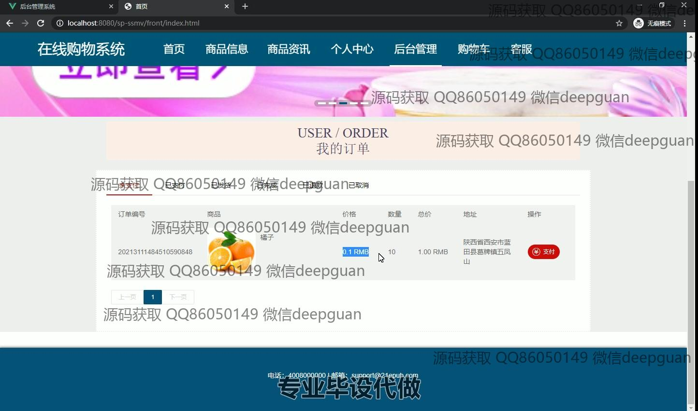

<h1 align="center">基于Vue.js的在线购物系统的设计与实现+vue</h1>

## 简介
在线购物系统：角色分为管理员、用户；实现商品管理、分类管理、订单管理、购物车功能、客服互动，提供简洁高效的购物体验与后台管理功能。    --计算机毕业设计源码；毕设源码；java毕业设计源码

## 联系方式

<h3 align="center">获取完整代码与数据库文件 + 微信：deepguan QQ: 86050149 QQ群: 783742310</h3>

<h3 align="center">可帮忙远程部署 包运行成功！提供远程部署、修改代码、设计文档指导、代码讲解等服务！</h3>

## 功能介绍（完整见运行截图）
管理员：后台管理系统提供多功能菜单，包含个人中心、用户管理、商品分类管理、商品信息管理、商品入库与出库管理、订单管理、系统管理等模块。管理员可以进行商品信息的添加、编辑和删除，包括上传图片，填写分类、尺寸、颜色、数量和详细描述等。在订单管理中，支持查看订单详情、支付状态更新和订单搜索。客服管理允许管理员查看用户消息并进行回复，提供便捷的用户互动管理。系统设计简洁明了，功能分布清晰，提高了管理效率。

用户：在线购物系统支持用户进行个人资料查看与修改、订单查询、地址管理和收藏功能。用户可以通过导航栏访问各类模块，包括首页、商品信息、个人中心和客服。购物功能完善，提供商品列表、搜索、商品详情查看以及购物车结算。用户还可以调整商品数量，添加至购物车或进行即时购买。评论功能需登录后使用，支持提交和重置评论。在购物车中，可以查看选择的商品名称、价格、数量及总价，并进行购买。整体界面设计友好，提升了购物体验。

## 运行截图

本代码来源于网络,仅供学习参考使用!

